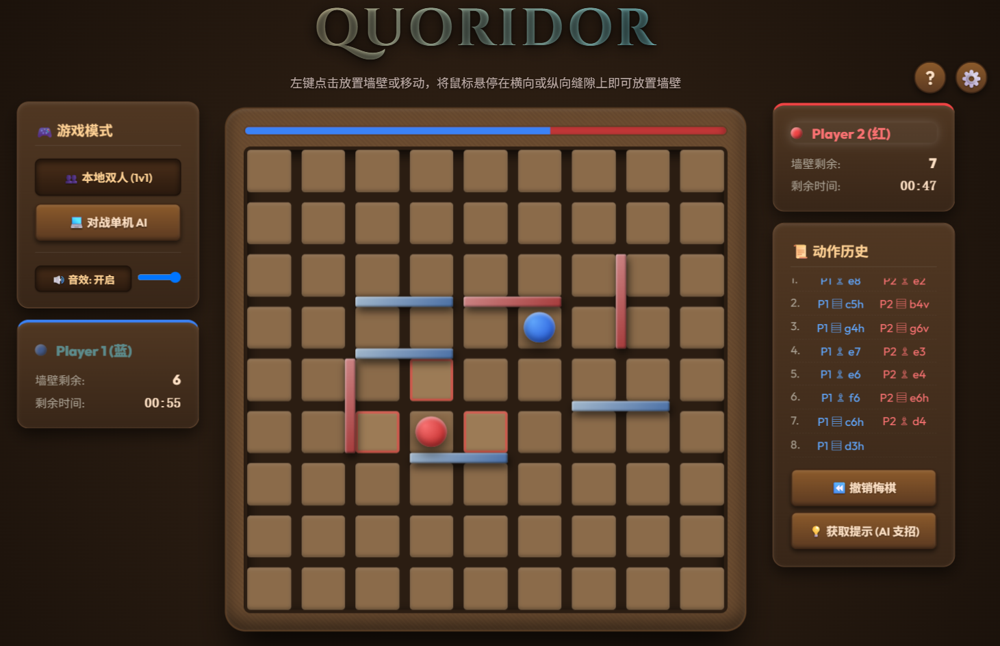

# Quoridor (路障棋)

一个现代网页版路障棋（Quoridor）游戏，支持本地双人对战与单机 AI 对战。



## 功能特性

* **双人对战**：支持在同一设备上进行两人对局。
* **单机 AI 对战**：内置 AI 对手，支持不同难度（可选）。
* **动作历史**：详细记录每一步行棋和放置墙壁的动作历史。
* **撤销悔棋**：可以撤销上一步操作。
* **AI 提示**：支持 AI 支招功能。
* **精美 UI**：适配现代网页界面和流畅动画。

## 运行

1. 安装依赖：
   ```bash
   npm install
   ```
2. 启动开发服务器：
   ```bash
   npm run dev
   ```

## 构建

```bash
npm run build
```

## 声明 (Notice)

**本项目仅供个人学习、研究与娱乐使用，严禁用于任何商业目的或盈利行为。**
